# 🐳 Hướng Dẫn Tường Tận: Docker Hoạt Động Như Thế Nào

> Tài liệu này giải thích Docker từ gốc rễ, sử dụng chính dự án `classs-with-member-khang` làm ví dụ thực tế xuyên suốt.

---

## Mục Lục

1. [Docker Là Gì? — Ví Dụ Thực Tế](#-1-docker-là-gì--ví-dụ-thực-tế)
2. [3 Khái Niệm Cốt Lõi](#-2-ba-khái-niệm-cốt-lõi-image-container-volume)
3. [Dockerfile — Bản Thiết Kế](#-3-dockerfile--bản-thiết-kế-chi-tiết)
4. [Docker Compose — Nhạc Trưởng](#-4-docker-compose--nhạc-trưởng-điều-phối)
5. [Networking — Các Container Nói Chuyện Với Nhau](#-5-networking--các-container-nói-chuyện-với-nhau-như-thế-nào)
6. [Volumes — Dữ Liệu Tồn Tại Như Thế Nào](#-6-volumes--dữ-liệu-tồn-tại-như-thế-nào)
7. [Lifecycle — Vòng Đời Của Container](#-7-lifecycle--vòng-đời-hoàn-chỉnh)
8. [Luồng Khởi Động Dự Án Từ A→Z](#-8-luồng-khởi-động-dự-án-từ-az)
9. [.dockerignore — Tại Sao Cần?](#-9-dockerignore--tại-sao-cần)
10. [Environment Variables — Biến Môi Trường Chảy Đi Đâu?](#-10-environment-variables--biến-môi-trường-chảy-đi-đâu)
11. [Makefile — Bộ Điều Khiển](#-11-makefile--bộ-điều-khiển)
12. [Khi Nào Nên/Không Nên Dùng Docker](#-12-khi-nào-nên--không-nên-dùng-docker)
13. [Troubleshooting — Xử Lý Lỗi Thường Gặp](#-13-troubleshooting--xử-lý-lỗi-thường-gặp)
14. [Tổng Kết Bức Tranh Toàn Cảnh](#-14-tổng-kết-bức-tranh-toàn-cảnh)

---

## 📦 1. Docker Là Gì? — Ví Dụ Thực Tế

### Vấn Đề Docker Giải Quyết

Tưởng tượng bạn gửi code cho một thành viên trong nhóm. Họ chạy thì báo lỗi:

```
"Máy mình không có PostgreSQL 16"
"Node version máy mình là 18, code yêu cầu 20"
"Máy mình dùng Windows mà code chỉ chạy trên Mac"
```

Docker giải quyết vấn đề này bằng cách **đóng gói** toàn bộ ứng dụng + môi trường vào một "hộp" (container) chạy giống nhau **ở mọi máy**.

### So Sánh Trực Quan

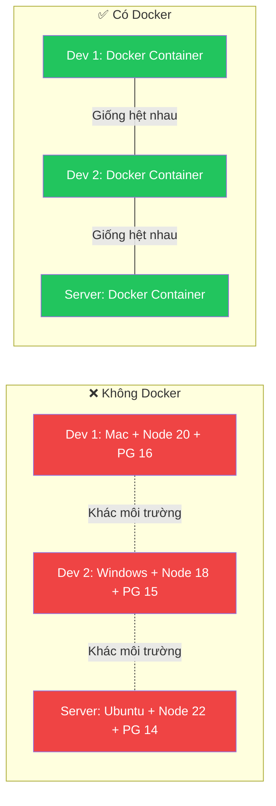

### Docker vs Virtual Machine (VM)

| Tiêu chí | Docker Container | Virtual Machine |
|----------|-----------------|-----------------|
| Khởi động | **~2 giây** | ~30-60 giây |
| Dung lượng | **~200MB** | ~2-10GB |
| RAM sử dụng | **Chia sẻ kernel** | Mỗi VM có OS riêng |
| Isolation | Process-level | Hardware-level |
| Hiệu năng | **~95% native** | ~70-80% native |

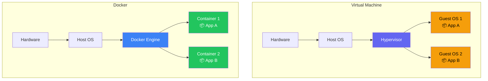

> [!IMPORTANT]
> Docker container **KHÔNG** chứa cả hệ điều hành. Nó chia sẻ kernel của máy host → nhẹ hơn VM rất nhiều.

---

## 🧱 2. Ba Khái Niệm Cốt Lõi: Image, Container, Volume

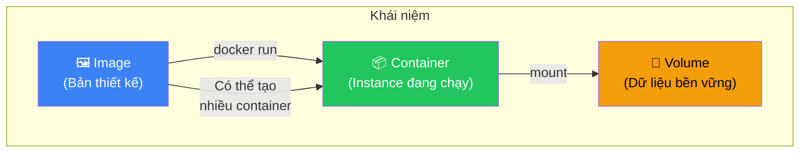

### 🖼️ Image — Bản Thiết Kế (Blueprint)

Giống như **file ISO cài Windows** — nó chứa mọi thứ cần thiết nhưng chưa "chạy".

**Trong dự án bạn**:
- `node:20-alpine` = Image có sẵn Node.js 20 trên Alpine Linux
- `postgres:16` = Image có sẵn PostgreSQL 16

**Đặc tính quan trọng**:
- **Read-only** — Image không bao giờ bị thay đổi
- **Layered** — Xếp chồng nhiều lớp, mỗi dòng trong Dockerfile = 1 layer
- **Shareable** — Upload lên Docker Hub để team dùng chung

### 📦 Container — Instance Đang Chạy

Giống như **máy ảo đang bật** — nó là bản copy từ Image đang chạy thực sự.

**Trong dự án bạn**:
- `node_app` = Container chạy ứng dụng Node.js
- `postgres-khang` = Container chạy PostgreSQL

**Đặc tính quan trọng**:
- **Có thể đọc/ghi** — Container có thể tạo file, nhưng khi xóa container → mất hết
- **Cô lập** — Mỗi container có filesystem, network, process riêng
- **Ephemeral** — Được thiết kế để xóa và tạo lại bất cứ lúc nào

### 💾 Volume — Dữ Liệu Bền Vững

Giống như **ổ cứng ngoài** — cắm vào container nào cũng được, rút ra thì data vẫn còn.

**Trong dự án bạn**:
- `postgres_data` = Nơi lưu trữ database, container bị xóa nhưng data vẫn còn

> [!CAUTION]
> **Nếu không dùng Volume**: Khi chạy `make down` rồi `make up` lại → toàn bộ database sẽ mất sạch, phải seed lại từ đầu!

---

## 📝 3. Dockerfile — Bản Thiết Kế Chi Tiết

File [docker/dev/dockerfile](file:///Users/truongnguyenbaokhang/classs-with-member-khang/docker/dev/dockerfile) trong dự án:

```dockerfile
FROM node:20-alpine          # Bước 1
WORKDIR /app                 # Bước 2
COPY package*.json ./        # Bước 3
RUN npm install              # Bước 4
COPY . .                     # Bước 5
EXPOSE 5001                  # Bước 6
CMD ["npm", "run", "dev"]    # Bước 7
```

### Giải Thích Từng Dòng — Analogy Xây Nhà

```mermaid
graph TB
    subgraph "🏗️ Dockerfile = Bản vẽ xây nhà"
        S1["FROM node:20-alpine<br/>━━━━━━━━━━━━━━━━<br/>🏠 Chọn nền móng<br/>(Alpine Linux + Node.js 20)"]
        S2["WORKDIR /app<br/>━━━━━━━━━━━━━━━━<br/>📂 Xác định phòng làm việc<br/>(thư mục /app trong container)"]
        S3["COPY package*.json ./<br/>━━━━━━━━━━━━━━━━<br/>📋 Mang danh sách vật liệu vào<br/>(chỉ file khai báo dependencies)"]
        S4["RUN npm install<br/>━━━━━━━━━━━━━━━━<br/>🔧 Mua vật liệu theo danh sách<br/>(cài đặt thư viện)"]
        S5["COPY . .<br/>━━━━━━━━━━━━━━━━<br/>📦 Mang đồ nội thất vào<br/>(copy toàn bộ source code)"]
        S6["EXPOSE 5001<br/>━━━━━━━━━━━━━━━━<br/>🚪 Đánh dấu cửa ra vào<br/>(khai báo port, chỉ là metadata)"]
        S7["CMD npm run dev<br/>━━━━━━━━━━━━━━━━<br/>🔑 Lệnh khi mở cửa nhà<br/>(lệnh chạy khi container start)"]
    end

    S1 --> S2 --> S3 --> S4 --> S5 --> S6 --> S7

    style S1 fill:#6366f1,color:#fff
    style S2 fill:#8b5cf6,color:#fff
    style S3 fill:#a78bfa,color:#000
    style S4 fill:#c4b5fd,color:#000
    style S5 fill:#ddd6fe,color:#000
    style S6 fill:#ede9fe,color:#000
    style S7 fill:#f5f3ff,color:#000
```

### Layer Caching — Tại Sao Thứ Tự Quan Trọng?

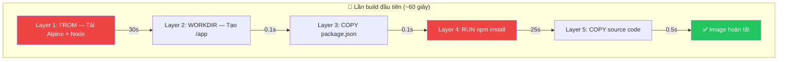

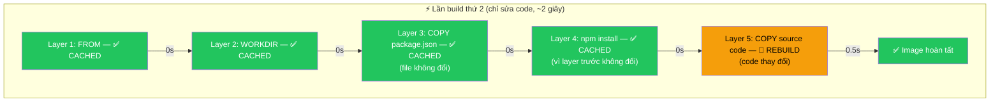

> [!TIP]
> **Quy tắc vàng**: Đặt những thứ **ít thay đổi** (dependencies) lên TRƯỚC, những thứ **hay thay đổi** (source code) xuống SAU. Docker sẽ cache các layer trên → build cực nhanh.

### Nếu Đảo Ngược Thứ Tự Thì Sao?

```dockerfile
# ❌ SAI — Mỗi lần sửa code phải cài lại npm
COPY . .                    # Source code thay đổi → layer này rebuild
RUN npm install             # Layer trước rebuild → layer này CŨNG rebuild
                            # Mỗi lần sửa 1 dòng code = chờ 30s npm install
```

> [!CAUTION]
> Nếu đặt `COPY . .` trước `RUN npm install`: mỗi lần sửa BẤT KỲ file nào trong source → Docker phải chạy lại `npm install` (~30 giây) dù dependencies KHÔNG đổi!

### `alpine` Là Gì?

```
node:20          → Image dựa trên Debian Linux (~350MB)
node:20-alpine   → Image dựa trên Alpine Linux (~180MB)
node:20-slim     → Image Debian nhưng bỏ bớt tools (~200MB)
```

**Alpine Linux** = bản phân phối Linux siêu nhỏ (~5MB). Ưu điểm: nhẹ, nhanh, ít lỗ hổng bảo mật. Nhược điểm: dùng `musl` thay vì `glibc`, một số native module (bcrypt, sharp) CÓ THỂ bị lỗi.

---

## 🎼 4. Docker Compose — Nhạc Trưởng Điều Phối

### Tại Sao Cần Docker Compose?

Nếu không có Compose, bạn phải chạy **thủ công từng container**:

```bash
# Không Compose → phải tự gõ từng dòng, thứ tự, cấu hình...
docker network create my-net
docker volume create pg-data
docker run -d --name postgres-khang --network my-net -v pg-data:/var/lib/postgresql/data -e POSTGRES_USER=postgres -e POSTGRES_PASSWORD=password -p 5434:5432 postgres:16
docker build -t my-app -f docker/dev/dockerfile .
docker run -d --name node_app --network my-net -v .:/app -p 5001:5001 --env-file .env my-app
```

Với Compose, chỉ cần 1 lệnh: **`docker compose up -d`**

### Phân Tích Từng Dòng [docker-compose-dev.yml](file:///Users/truongnguyenbaokhang/classs-with-member-khang/docker-compose-dev.yml)

````carousel
### Service 1: `app` (Node.js Application)

```yaml
services:
  app:                            # Tên service (cũng là hostname trong Docker network)
    build:
      context: .                  # "Build context" = thư mục gốc dự án
      dockerfile: docker/dev/dockerfile  # Đường dẫn đến Dockerfile
    container_name: node_app      # Tên cố định cho container
    ports:
      - "5001:5001"               # HOST_PORT:CONTAINER_PORT
    volumes:
      - .:/app                    # Bind mount: code local → container
      - /app/node_modules         # Anonymous volume: bảo vệ node_modules
    env_file:
      - .env                      # Load biến môi trường từ file .env
    depends_on:
      - postgres                  # Khởi động postgres TRƯỚC app
    restart: unless-stopped       # Tự restart nếu crash
```
<!-- slide -->
### Service 2: `postgres` (Database)

```yaml
  postgres:                       # Tên service = hostname
    image: postgres:16            # Dùng image có sẵn (không cần build)
    container_name: postgres-khang
    environment:                  # Biến môi trường cho PostgreSQL
      POSTGRES_USER: ${DB_USER:-postgres}       # Đọc từ .env, fallback "postgres"
      POSTGRES_PASSWORD: ${DB_PASSWORD:-postgres}
      POSTGRES_DB: ${DB_NAME:-mydb}
    ports:
      - "5434:5432"               # Map port 5434 máy local → 5432 container
    volumes:
      - postgres_data:/var/lib/postgresql/data   # Named volume cho data
      - ./docker/postgres/init.sql:/docker-entrypoint-initdb.d/init.sql:ro  # SQL init
    restart: unless-stopped
```
<!-- slide -->
### Volume Declaration

```yaml
volumes:
  postgres_data:                  # Khai báo named volume ở top-level
                                  # Docker tự quản lý vị trí lưu trữ
```

Nếu **không khai báo ở đây** → Docker sẽ báo lỗi khi service `postgres` cố mount `postgres_data`.
````

### `build` vs `image` — Hai Cách Tạo Container

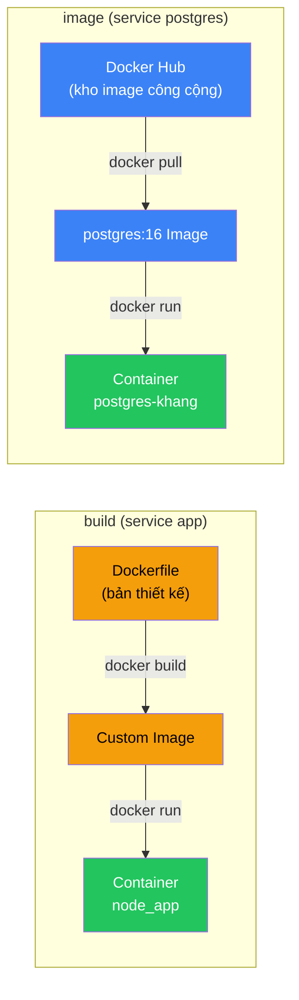

| Từ khóa | Khi nào dùng | Ví dụ trong dự án |
|---------|-------------|-------------------|
| `build` | Code của bạn, cần custom Dockerfile | Service `app` — Node.js app |
| `image` | Dùng image có sẵn, không cần customize | Service `postgres` — PostgreSQL 16 |

---

## 🌐 5. Networking — Các Container Nói Chuyện Với Nhau Như Thế Nào

### Docker Compose Tự Tạo Network

> [!IMPORTANT]
> Khi chạy `docker compose up`, Docker Compose **tự động** tạo một network riêng cho tất cả services. Bạn KHÔNG cần khai báo thủ công.

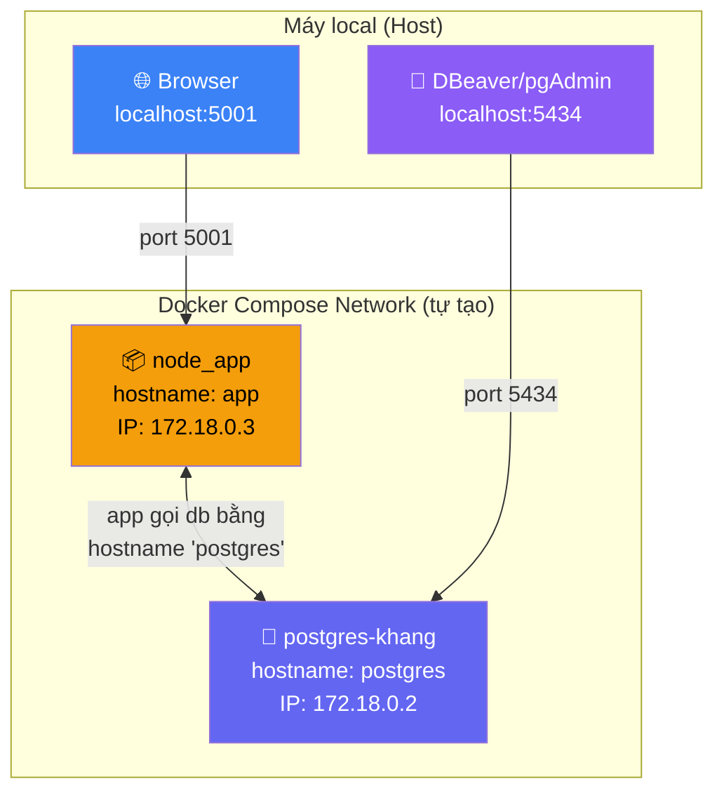

### Quy Tắc Giao Tiếp

| Từ | Đến | Cách gọi | Port |
|----|-----|----------|------|
| `node_app` → | `postgres-khang` | `postgres:5432` (hostname = tên service) | **5432** (internal) |
| Browser (máy local) → | `node_app` | `localhost:5001` | **5001** (mapped) |
| DBeaver (máy local) → | `postgres-khang` | `localhost:5434` | **5434** (mapped) |
| Container → | Internet | Trực tiếp (qua host network) | Bất kỳ |

### Tại Sao `.env` Có `DB_HOST=postgres`?

```
DB_HOST=postgres   ← Đây là tên SERVICE trong docker-compose, KHÔNG phải localhost
DB_PORT=5434       ← ⚠️ Đây là port MAPPED ra ngoài host
```

> [!WARNING]
> **Bẫy thường gặp**: Khi Node.js app chạy **BÊN TRONG** Docker container và kết nối đến PostgreSQL:
> - `DB_HOST` nên là `postgres` (tên service) ✅
> - `DB_PORT` nên là `5432` (port INTERNAL của container) ✅
> 
> Port `5434` chỉ dùng khi kết nối **TỪ MÁY LOCAL** (ngoài Docker) vào database.
> 
> `.env` hiện tại có `DB_PORT=5434` — điều này sẽ **KHÔNG hoạt động** khi app chạy trong Docker! Nên sửa thành `5432`.

### DNS Resolution Trong Docker Network

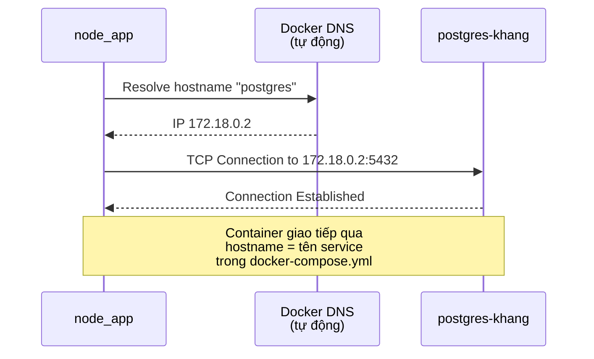

> Docker tích hợp sẵn **DNS server** — khi container A gọi hostname "postgres", Docker tự phân giải thành IP nội bộ của container B.

---

## 💾 6. Volumes — Dữ Liệu Tồn Tại Như Thế Nào

Dự án sử dụng **3 loại volume khác nhau**. Đây là điểm dễ nhầm lẫn nhất.

### Bảng So Sánh 3 Loại Volume

| Loại | Cú pháp | Trong dự án | Mục đích |
|------|---------|-------------|----------|
| **Bind Mount** | `host_path:container_path` | `.:/app` | Sync code real-time |
| **Named Volume** | `volume_name:container_path` | `postgres_data:/var/lib/postgresql/data` | Lưu DB bền vững |
| **Anonymous Volume** | `/container_path` | `/app/node_modules` | Bảo vệ thư mục |

### 📂 Bind Mount: `.:/app`

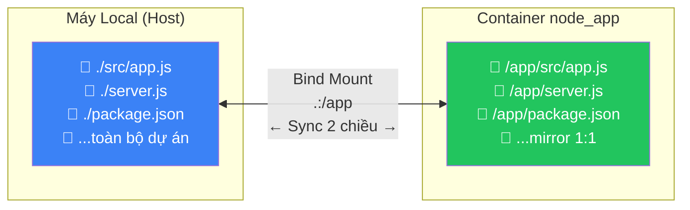

**Hoạt động**:
- Bạn sửa `src/app.js` trên VS Code → container **thấy ngay** sự thay đổi
- Node.js `--watch` flag phát hiện file thay đổi → **tự restart** server
- **Kết quả**: Hot reload — sửa code, save, refresh browser = thấy kết quả mới

> [!TIP]
> Bind mount = "chiếu" thư mục local vào container. Hai bên nhìn **chung một file** — không phải copy.

### 💾 Named Volume: `postgres_data`

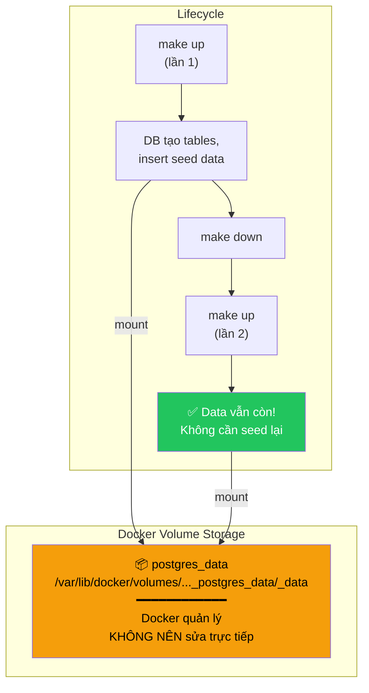

**Hoạt động**:
- Lần đầu `make up`: PostgreSQL tạo database, chạy `init.sql`, lưu data vào volume
- `make down`: Container bị xóa, **NHƯNG** volume `postgres_data` **VẪN TỒN TẠI**
- Lần tiếp `make up`: Container mới mount vào volume cũ → data nguyên vẹn

**Khi nào data bị mất?**

```bash
make down              # ❌ Chỉ xóa container, data CÒN
make clean             # ⚠️ Chạy "docker compose down -v" → XÓA VOLUME → DATA MẤT
docker volume rm ...   # ⚠️ Xóa volume thủ công → DATA MẤT
```

### 🛡️ Anonymous Volume: `/app/node_modules`

Đây là volume phức tạp nhất và ít được hiểu rõ nhất:

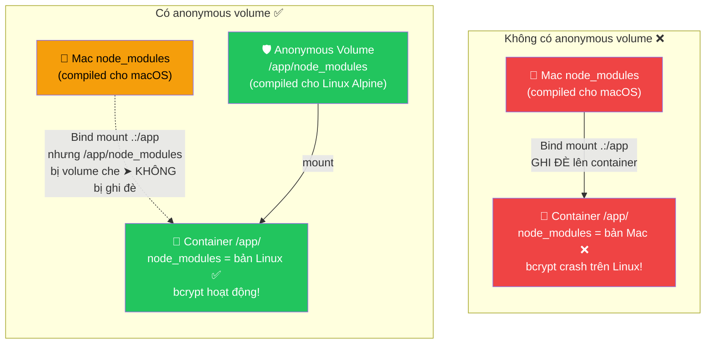

**Giải thích**:
1. `- .:/app` mount **toàn bộ** thư mục gốc vào `/app` — bao gồm cả `node_modules`
2. `- /app/node_modules` tạo anonymous volume **đè lên** path `/app/node_modules`
3. Kết quả: container dùng `node_modules` được install BÊN TRONG container (Linux) thay vì bản từ máy Mac

> [!IMPORTANT]
> Thứ tự volume matters! Docker mount anonymous volume **SAU** bind mount → anonymous volume "thắng" trong path `/app/node_modules`.

### 📄 Init SQL Mount

```yaml
- ./docker/postgres/init.sql:/docker-entrypoint-initdb.d/init.sql:ro
```

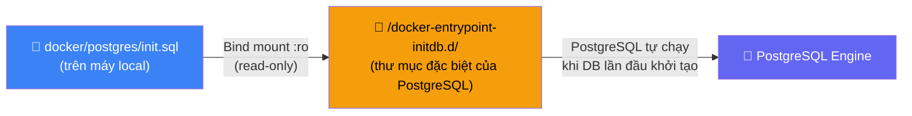

**Chi tiết quan trọng**:
- `:ro` = read-only → container không thể sửa file này
- `/docker-entrypoint-initdb.d/` là thư mục "magic" của PostgreSQL image — mọi file `.sql` hoặc `.sh` trong đây sẽ **tự động chạy** khi database khởi tạo LẦN ĐẦU
- **Chỉ chạy lần đầu**: Nếu volume `postgres_data` đã có data → file này BỊ BỎ QUA

> [!WARNING]
> Nếu bạn sửa `init.sql` và muốn chạy lại: phải xóa volume trước!
> ```bash
> make clean    # xóa container + volume
> make up       # tạo lại từ đầu → init.sql chạy lại
> ```

---

## 🔄 7. Lifecycle — Vòng Đời Hoàn Chỉnh

### Trạng Thái Của Container

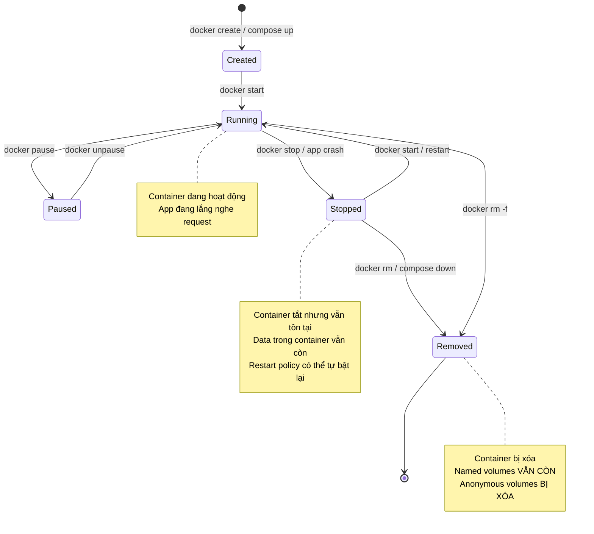

### `restart: unless-stopped` Hoạt Động Thế Nào?

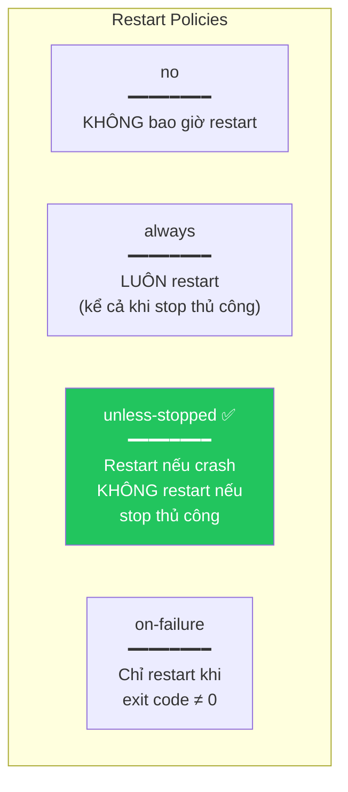

| Tình huống | `unless-stopped` sẽ... |
|------------|----------------------|
| App crash (exit code 1) | ✅ Tự restart |
| Máy reboot | ✅ Tự restart |
| `docker stop node_app` | ❌ Không restart |
| `make down` | ❌ Không restart (container bị xóa) |

---

## 🚀 8. Luồng Khởi Động Dự Án Từ A→Z

### Khi Bạn Gõ `make up` (hoặc `make rebuild`)

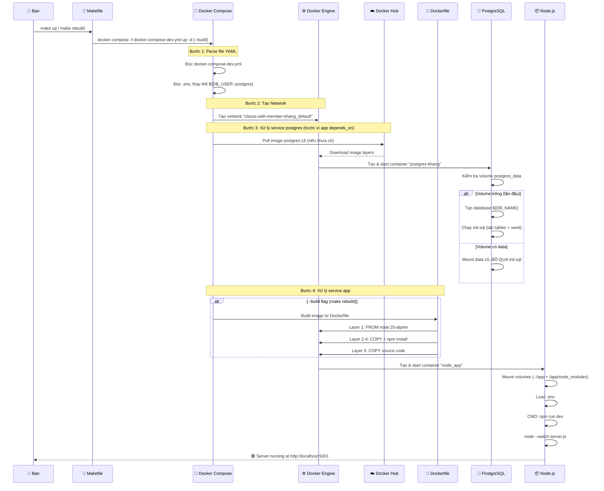

### Timeline Thực Tế

```
⏱️ 0s    — Gõ "make rebuild"
⏱️ 1s    — Docker Compose parse YAML, tạo network
⏱️ 2s    — Pull postgres:16 (cached) / Build Node image (cached)
⏱️ 3s    — Start container postgres-khang
⏱️ 4s    — PostgreSQL ready, chạy init.sql (nếu lần đầu)
⏱️ 5s    — Start container node_app
⏱️ 6s    — npm run dev → Node.js listening
⏱️ 7s    — 🟢 http://localhost:5001 → "Hello World!"
```

---

## 🚫 9. `.dockerignore` — Tại Sao Cần?

File [.dockerignore](file:///Users/truongnguyenbaokhang/classs-with-member-khang/.dockerignore):

```
node_modules       ← 50MB+ thư mục, không cần vì Dockerfile tự npm install
npm-debug.log      ← File debug, không cần trong image
Dockerfile         ← Bản thân file này không cần trong app
docker-compose.yml ← File compose không cần trong container
.git               ← Lịch sử Git có thể rất nặng
.gitignore         ← Không cần trong container
.env               ← ⚠️ BÍ MẬT! Không nên bake vào image
.vscode            ← Cấu hình IDE
```

### Tại Sao Quan Trọng?

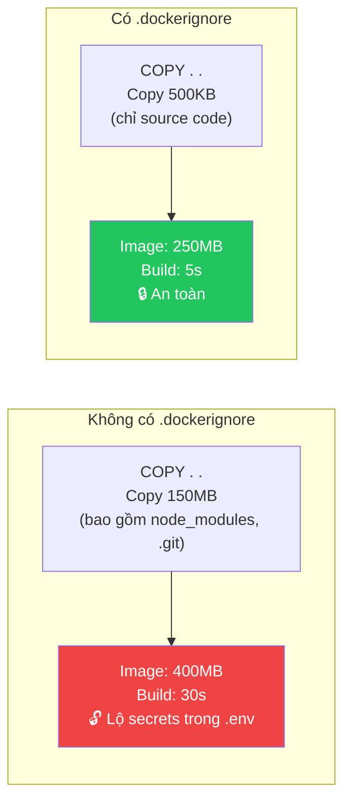

> [!CAUTION]
> **Bảo mật**: Nếu không ignore `.env`, mật khẩu database sẽ bị **bake vào image**. Ai có image = ai có mật khẩu. Nếu push image lên Docker Hub → lộ hoàn toàn.

---

## 🔐 10. Environment Variables — Biến Môi Trường Chảy Đi Đâu?

### Dòng Chảy Biến Môi Trường

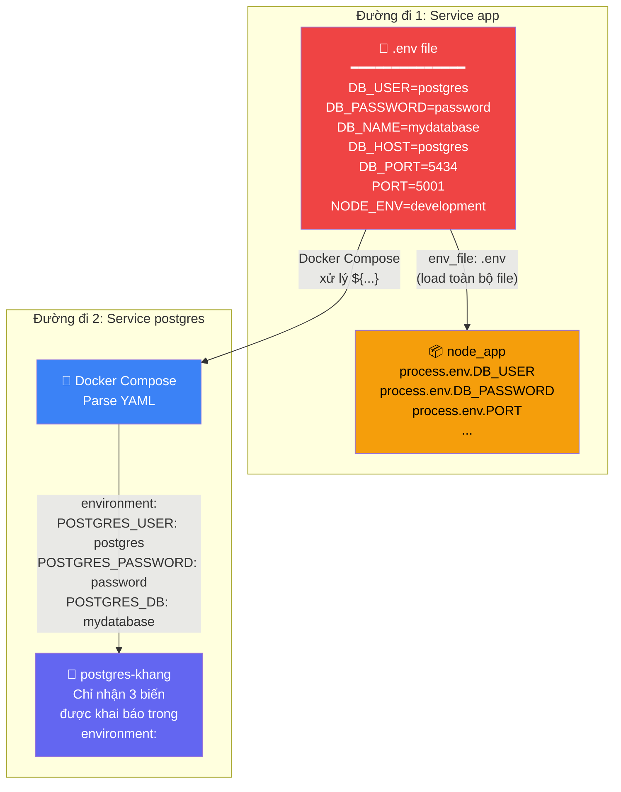

### Hai Cách Load Biến — Sự Khác Biệt

| Cách | Cú pháp | Service | Kết quả |
|------|---------|---------|---------|
| `env_file` | `env_file: .env` | `app` | Load **TẤT CẢ** biến trong `.env` → container |
| `environment` + `${...}` | `POSTGRES_USER: ${DB_USER:-postgres}` | `postgres` | Docker Compose đọc `.env`, **thay thế** giá trị, chỉ truyền biến được khai báo |

### Cú Pháp `${DB_USER:-postgres}` Là Gì?

```
${DB_USER:-postgres}
   │         │
   │         └── Giá trị fallback nếu DB_USER không tồn tại
   └── Tên biến trong .env
```

| .env có `DB_USER`? | Giá trị | Kết quả |
|--------------------|---------|---------|
| `DB_USER=khang` | Có | `POSTGRES_USER=khang` |
| (không có dòng DB_USER) | Không | `POSTGRES_USER=postgres` (fallback) |

---

## 🎮 11. Makefile — Bộ Điều Khiển

File [makefile](file:///Users/truongnguyenbaokhang/classs-with-member-khang/makefile) là "remote control" của dự án:

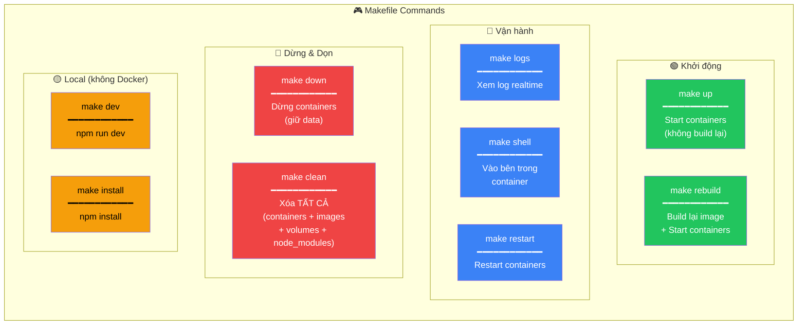

### Khi Nào Dùng Lệnh Nào?

| Tình huống | Lệnh | Giải thích |
|------------|-------|-----------|
| Lần đầu clone dự án | `make rebuild` | Build image + start |
| Bắt đầu ngày làm việc | `make up` | Start containers (dùng image cũ) |
| Thay đổi Dockerfile hoặc package.json | `make rebuild` | Phải build lại image |
| Thay đổi source code | Không cần lệnh! | Bind mount + `--watch` auto reload |
| Debug lỗi container | `make logs` → `make shell` | Xem log, vào container kiểm tra |
| Kết thúc ngày làm việc | `make down` | Dừng containers, giữ data |
| Database bị hỏng / muốn reset | `make clean` → `make rebuild` | Xóa sạch, tạo lại từ đầu |

### `make up` vs `make rebuild` — Khác Gì?

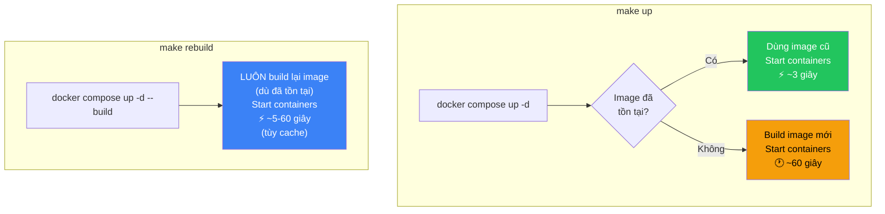

---

## ⚖️ 12. Khi Nào Nên / Không Nên Dùng Docker

### ✅ Nên Dùng Docker

| Lý do | Giải thích |
|-------|-----------|
| **Team development** | Mọi người chạy cùng môi trường, không "máy tao chạy được" |
| **Nhiều services** | App + DB + Redis + Elasticsearch → 1 lệnh `docker compose up` |
| **CI/CD** | Build → Test → Deploy đều chạy trong container |
| **Microservices** | Mỗi service 1 container, scale độc lập |
| **Onboarding** | Developer mới clone repo → `make rebuild` → chạy ngay |

### ❌ Hạn Chế

| Vấn đề | Chi tiết |
|--------|---------|
| **Tốn tài nguyên** | Docker Desktop trên Mac dùng thêm ~2GB RAM |
| **Performance trên Mac** | File I/O qua bind mount chậm hơn native ~30% |
| **Learning curve** | Cần hiểu networking, volumes, layers |
| **Debugging** | Khó debug hơn khi app chạy "ở trong hộp" |

---

## 🔧 13. Troubleshooting — Xử Lý Lỗi Thường Gặp

### Lỗi 1: "Port already in use"

```bash
Error: bind address already in use: 0.0.0.0:5001
```

**Nguyên nhân**: Port 5001 đã bị chiếm (bởi container cũ hoặc app khác)

**Cách fix**:
```bash
# Tìm process đang chiếm port
lsof -i :5001

# Kill process đó, hoặc:
make down              # Dừng container cũ
docker rm -f node_app  # Xóa container cũ bị treo
```

---

### Lỗi 2: "ECONNREFUSED khi kết nối database"

```
Error: connect ECONNREFUSED 127.0.0.1:5434
```

**Nguyên nhân & Giải pháp**:

| Chạy ở đâu | DB_HOST nên là | DB_PORT nên là |
|-------------|----------------|----------------|
| Trong Docker container | `postgres` | `5432` |
| Trên máy local (ngoài Docker) | `localhost` | `5434` |

---

### Lỗi 3: "init.sql không chạy lại"

**Nguyên nhân**: Volume `postgres_data` đã có data → PostgreSQL bỏ qua `init.sql`

**Cách fix**:
```bash
make clean     # Xóa volume
make rebuild   # Tạo lại từ đầu → init.sql chạy lại
```

---

### Lỗi 4: "Module not found trong container"

```
Error: Cannot find module 'express'
```

**Nguyên nhân**: `node_modules` trong container rỗng (anonymous volume chưa được init)

**Cách fix**:
```bash
make rebuild   # Build lại image → npm install chạy lại trong container
```

---

### Lỗi 5: "Permission denied trên Mac"

```bash
# Nếu bind mount gặp lỗi permission
docker exec -it node_app ls -la /app
```

**Cách fix**: Đảm bảo Docker Desktop có quyền truy cập thư mục dự án (Settings → Resources → File sharing)

---

## 🌍 14. Tổng Kết Bức Tranh Toàn Cảnh

```mermaid
graph TB
    subgraph "📱 Máy Của Bạn (macOS)"
        VSCODE["VS Code<br/>Sửa code"]
        BROWSER["Browser<br/>localhost:5001"]
        DBEAVER["DBeaver/pgAdmin<br/>localhost:5434"]
        TERM["Terminal<br/>make commands"]
        
        subgraph "🐳 Docker Desktop"
            subgraph "🌐 Docker Network"
                subgraph "📦 node_app container"
                    NODE["Node.js 20<br/>Alpine Linux"]
                    EXPRESS["Express.js 5<br/>server.js → app.js"]
                end
                
                subgraph "📦 postgres-khang container"  
                    PGSQL["PostgreSQL 16"]
                    PGDATA["Tables: users,<br/>categories, todos"]
                end
            end
            
            subgraph "💾 Volumes"
                BIND["Bind Mount<br/>.:/app"]
                NAMED["Named Volume<br/>postgres_data"]
                ANON["Anonymous Volume<br/>/app/node_modules"]
            end
        end
        
        SRC["📂 Source Code<br/>(trên ổ cứng Mac)"]
    end

    VSCODE -->|"edit"| SRC
    SRC <-->|"sync"| BIND
    BIND --> NODE
    ANON --> NODE
    BROWSER -->|":5001"| EXPRESS
    DBEAVER -->|":5434"| PGSQL
    TERM -->|"make up/down/..."| NODE
    EXPRESS -->|"hostname: postgres<br/>port: 5432"| PGSQL
    PGSQL --> PGDATA
    PGDATA -->|"persist"| NAMED

    style VSCODE fill:#007ACC,color:#fff
    style BROWSER fill:#3b82f6,color:#fff
    style DBEAVER fill:#8b5cf6,color:#fff
    style NODE fill:#22c55e,color:#fff
    style EXPRESS fill:#f59e0b,color:#000
    style PGSQL fill:#6366f1,color:#fff
    style BIND fill:#f97316,color:#fff
    style NAMED fill:#f97316,color:#fff
    style ANON fill:#f97316,color:#fff
    style SRC fill:#374151,color:#fff
```

### Tóm Tắt Mối Quan Hệ Giữa Các File Docker

| File | Làm gì | Liên kết với |
|------|--------|-------------|
| `docker-compose-dev.yml` | Định nghĩa toàn bộ hệ thống | Mọi file Docker khác |
| `docker/dev/dockerfile` | Cách build image Node.js | Được gọi bởi `docker-compose` |
| `docker/postgres/init.sql` | Tạo schema + seed data | Mounted vào container PostgreSQL |
| `.env` | Biến môi trường cho cả 2 services | Loaded bởi `docker-compose` |
| `.dockerignore` | Files không copy vào image | Được đọc khi `docker build` |
| `makefile` | Shortcut commands | Gọi `docker compose` commands |

### Một Câu Tóm Tắt

> **Docker Compose** đọc **docker-compose-dev.yml** + **.env** để biết cần chạy gì. Nó dùng **Dockerfile** để build image cho Node.js app, pull image **postgres:16** từ Hub, tạo **network** cho 2 container nói chuyện, mount **volumes** để sync code + persist data, rồi khởi động tất cả. **Makefile** chỉ là shortcut để gõ ít hơn.
