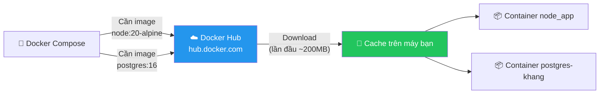
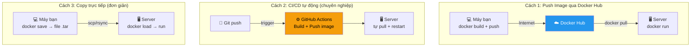
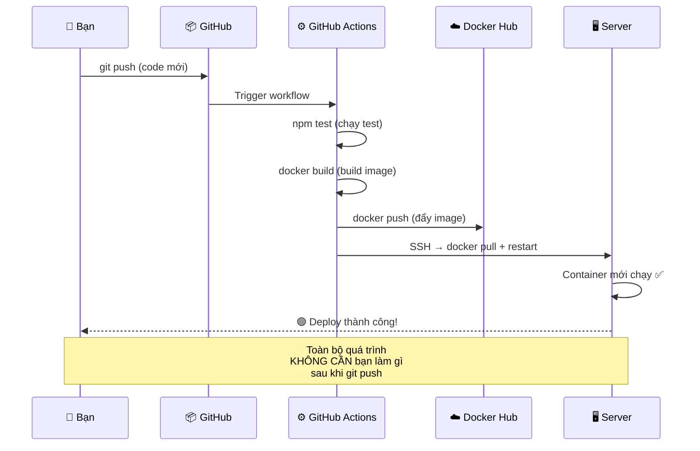
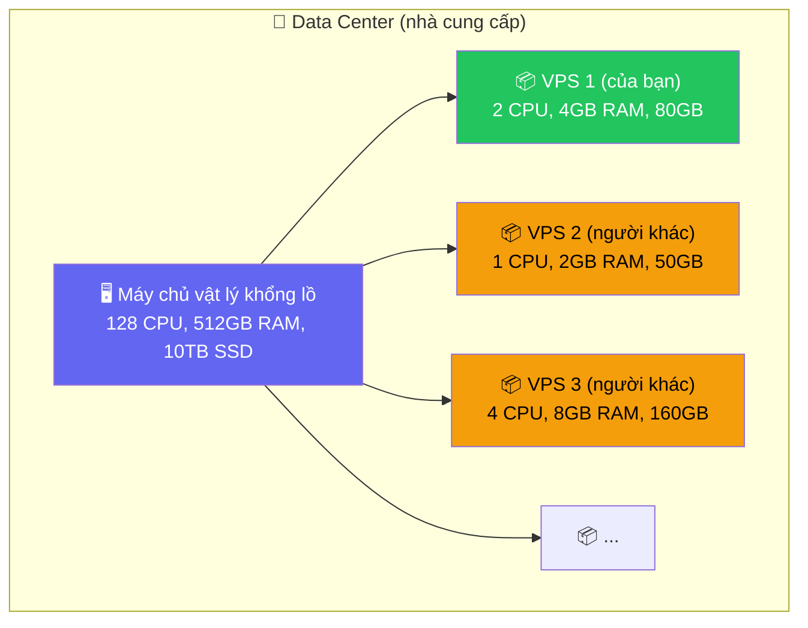
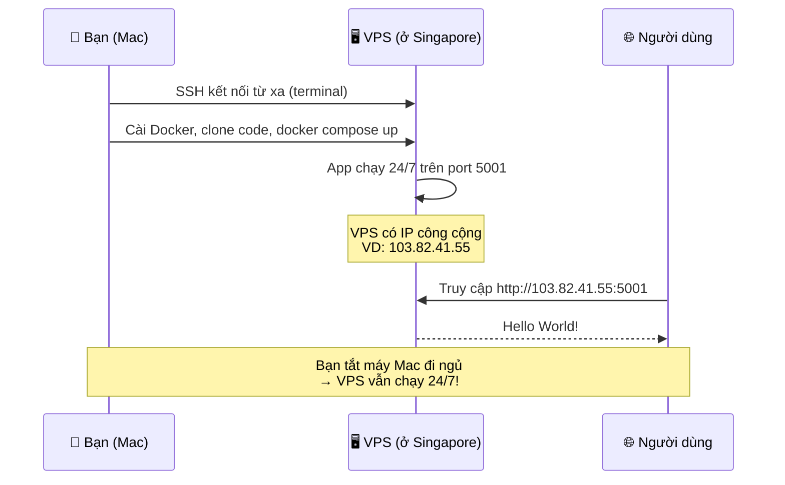
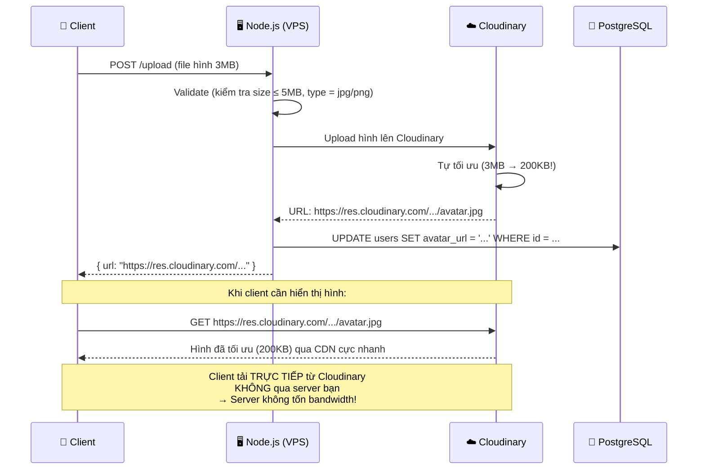
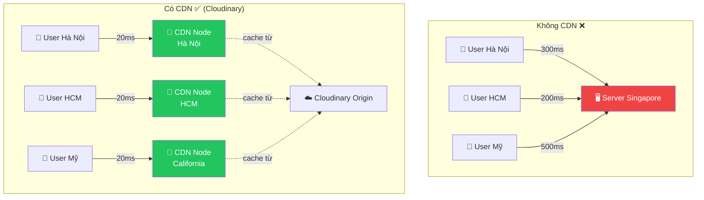
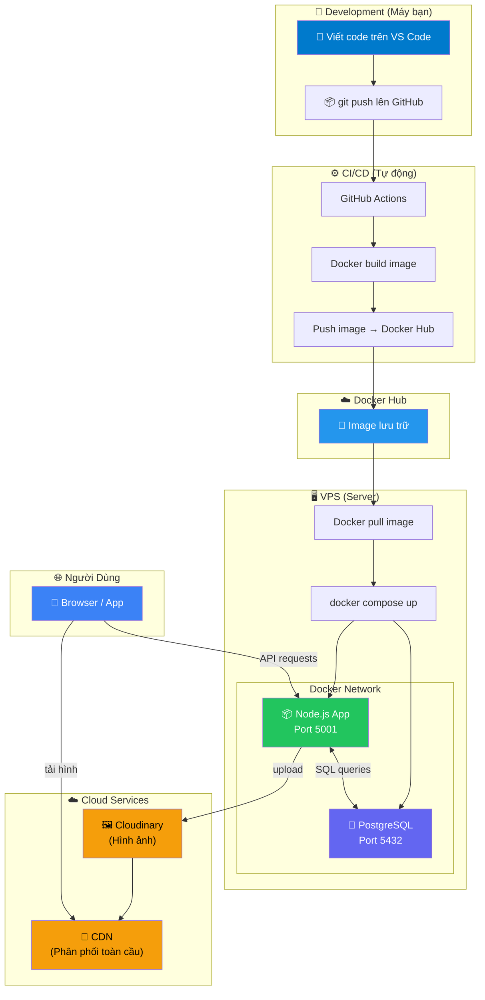

# 🚀 Hướng Dẫn Tường Tận: Docker Hub, Deploy, VPS & Xử Lý Hình Ảnh

> Tài liệu này tổng hợp kiến thức về hạ tầng và deployment — từ Docker Hub, cách deploy lên server, VPS là gì, cho đến chiến lược xử lý file hình ảnh nặng.

---

## Mục Lục

1. [Docker Hub — Kho Image Công Cộng](#-1-docker-hub--kho-image-công-cộng)
2. [Deploy Với Docker — Từ Máy Bạn Lên Internet](#-2-deploy-với-docker--từ-máy-bạn-lên-internet)
3. [VPS — Máy Tính Cho Thuê Trên Cloud](#-3-vps--máy-tính-cho-thuê-trên-cloud)
4. [Xử Lý Upload & Lưu Trữ Hình Ảnh](#-4-xử-lý-upload--lưu-trữ-hình-ảnh)
5. [Tổng Kết Bức Tranh Toàn Cảnh](#-5-tổng-kết-bức-tranh-toàn-cảnh)

---

## ☁️ 1. Docker Hub — Kho Image Công Cộng

### Docker Hub Là Gì?

**Docker Hub** = kho lưu trữ công cộng chứa hàng triệu Docker images. Tương tự như:

| Bạn đã biết | Docker tương đương |
|---|---|
| **App Store** → tải app | **Docker Hub** → tải image |
| **GitHub** → lưu source code | **Docker Hub** → lưu image đã build |
| **npm** → tải package JS | **Docker Hub** → tải image có sẵn |

### Docker Hub Trong Dự Án Của Bạn

Khi bạn chạy `make rebuild`, Docker tự tải 2 image từ Docker Hub:

```dockerfile
# docker/dev/dockerfile
FROM node:20-alpine        # ← Tải từ Docker Hub: image có Node.js 20 + Alpine Linux
```

```yaml
# docker-compose-dev.yml
image: postgres:16         # ← Tải từ Docker Hub: image có PostgreSQL 16
```



- **Lần đầu**: Docker tải image từ Hub → mất vài phút
- **Lần sau**: Dùng bản cache trên máy → gần như **0 giây**

### Ai Đăng Image Lên Docker Hub?

| Image | Tác giả | Mô tả |
|-------|---------|-------|
| `node` | Node.js team (Official ✅) | Node.js + npm sẵn sàng dùng |
| `postgres` | PostgreSQL team (Official ✅) | PostgreSQL server sẵn sàng |
| `nginx` | Nginx team (Official ✅) | Web server / Reverse proxy |
| `redis` | Redis team (Official ✅) | In-memory cache |
| `mysql` | Oracle (Official ✅) | MySQL server |

> [!NOTE]
> Các image có nhãn **Official Image** được Docker kiểm duyệt → an toàn, cập nhật thường xuyên, có tài liệu rõ ràng.

### Bạn Cũng Có Thể Push Image Của Mình Lên

```bash
# Build image dự án với tên bạn đặt
docker build -t khang/demo-app:1.0 .

# Đăng nhập Docker Hub
docker login

# Push lên Docker Hub
docker push khang/demo-app:1.0
```

Rồi trên server production hoặc máy đồng đội:
```bash
docker pull khang/demo-app:1.0    # Tải image về
docker run khang/demo-app:1.0     # Chạy — giống hệt máy bạn
```

### Public vs Private Repository

| Loại | Giá | Ai thấy | Khi nào dùng |
|------|-----|---------|-------------|
| **Public** | Miễn phí, không giới hạn | Tất cả mọi người | Open source, demo |
| **Private** | Free: 1 repo private | Chỉ bạn + team | Dự án thật, code bí mật |

> [!CAUTION]
> **Không bao giờ push image có chứa secrets** (mật khẩu, API key). Luôn dùng `.dockerignore` để loại bỏ `.env` trước khi build image.

---

## 🚀 2. Deploy Với Docker — Từ Máy Bạn Lên Internet

### Tổng Quan 3 Cách Deploy



---

### Cách 1: Thủ Công Qua Docker Hub (Dễ Nhất, Phù Hợp Người Mới)

**Trên máy bạn (Mac):**
```bash
# 1. Build image production
docker build -t khang/demo-app:1.0 -f docker/dev/dockerfile .

# 2. Đăng nhập Docker Hub
docker login

# 3. Push lên Docker Hub
docker push khang/demo-app:1.0
```

**Trên server (VPS):**
```bash
# 4. Pull image về
docker pull khang/demo-app:1.0

# 5. Chạy
docker compose up -d
```

---

### Cách 2: CI/CD Tự Động (Nên Dùng Cho Dự Án Thật)

Bạn **chỉ cần git push** → mọi thứ diễn ra tự động:



---

### Dev vs Production — Khác Nhau Chỗ Nào?

Dự án hiện tại chỉ có **Dockerfile cho dev**. Khi deploy thật, cần tách riêng:

```
docker/
├── dev/
│   └── dockerfile         ← Đang có (dev: hot reload, bind mount)
└── prod/
    └── dockerfile         ← Cần tạo thêm (production: tối ưu)
```

| | Dev (hiện tại) | Production (cần tạo) |
|---|---|---|
| Lệnh chạy | `npm run dev` (--watch) | `npm run prod` (không watch) |
| Source code | Bind mount (sync realtime) | COPY vào image (đóng gói) |
| node_modules | Anonymous volume | Cài trong image |
| Hot reload | ✅ Có | ❌ Không cần |
| Kích thước | Không quan trọng | Càng nhỏ càng tốt |

**Dockerfile production mẫu:**

```dockerfile
FROM node:20-alpine

WORKDIR /app

COPY package*.json ./
RUN npm install --omit=dev    # ← Chỉ cài production deps (không dev deps)

COPY . .

EXPOSE 5001

CMD ["npm", "run", "prod"]    # ← Dùng script prod
```

**docker-compose-prod.yml mẫu:**

```yaml
services:
  app:
    build:
      context: .
      dockerfile: docker/prod/dockerfile  # Dùng Dockerfile prod
    container_name: node_app
    ports:
      - "5001:5001"
    # KHÔNG có volumes bind mount (code đã COPY vào image)
    env_file:
      - .env
    depends_on:
      - postgres
    restart: always                        # always thay vì unless-stopped

  postgres:
    image: postgres:16
    container_name: postgres-khang
    environment:
      POSTGRES_USER: ${DB_USER:-postgres}
      POSTGRES_PASSWORD: ${DB_PASSWORD:-postgres}
      POSTGRES_DB: ${DB_NAME:-mydb}
    # KHÔNG expose port ra ngoài (bảo mật!)
    # ports: ← BỎ DÒNG NÀY
    volumes:
      - postgres_data:/var/lib/postgresql/data
      - ./docker/postgres/init.sql:/docker-entrypoint-initdb.d/init.sql:ro
    restart: always

volumes:
  postgres_data:
```

> [!IMPORTANT]
> **Khác biệt quan trọng nhất ở production:**
> - **Không expose port PostgreSQL** ra ngoài (bảo mật — chỉ Node.js app trong Docker network mới truy cập được)
> - **Không bind mount** (code được đóng gói trong image)
> - `restart: always` (luôn tự restart, kể cả sau reboot server)

---

## 🖥️ 3. VPS — Máy Tính Cho Thuê Trên Cloud

### VPS Là Gì?

**VPS = Virtual Private Server** = Máy tính ảo cho thuê, chạy 24/7 trên internet.



Nhà cung cấp lấy **1 máy vật lý mạnh** → chia thành **nhiều máy ảo nhỏ** → cho thuê riêng từng cái. Mỗi VPS hoạt động **độc lập**, có IP riêng, OS riêng.

### So Sánh Trực Quan

| Khái niệm | Tương đương thực tế |
|---|---|
| **Máy chủ vật lý (Dedicated)** | 🏠 Thuê nguyên căn nhà |
| **VPS** | 🏨 Thuê phòng khách sạn (riêng tư, có khóa, có phòng tắm riêng) |
| **Shared Hosting** | 🛏️ Giường ký túc xá (dùng chung mọi thứ) |
| **Cloud (AWS/GCP)** | 🏨 Resort 5 sao (mắc hơn, nhiều dịch vụ hơn) |

### VPS Hoạt Động Như Nào?



**Những gì VPS có:**

| Đặc tính | Chi tiết |
|---|---|
| **IP công cộng** | Ai cũng truy cập được qua internet (VD: 103.82.41.55) |
| **Chạy 24/7** | Không phụ thuộc máy bạn có bật hay không |
| **SSH access** | Bạn điều khiển VPS qua terminal từ xa |
| **Root quyền** | Cài bất kỳ phần mềm nào (Docker, Node, Nginx...) |
| **OS riêng** | Thường là Ubuntu hoặc Debian |

### Quy Trình Deploy Lên VPS

```bash
# ── Từ máy Mac, SSH vào VPS ──────────────────
ssh root@103.82.41.55

# ── Bây giờ bạn đang "ở trong" VPS (Linux) ──

# 1. Cài Docker (chỉ lần đầu)
curl -fsSL https://get.docker.com | sh

# 2. Clone code
git clone <repo-url>
cd classs-with-member-khang

# 3. Tạo file .env
nano .env    # paste biến môi trường vào, Ctrl+X để save

# 4. Chạy!
docker compose -f docker-compose-dev.yml up -d

# 🟢 App chạy tại http://103.82.41.55:5001
# Tắt máy Mac → VPS vẫn serve bình thường
```

### Thuê VPS Ở Đâu? Giá Bao Nhiêu?

#### Nhà Cung Cấp Quốc Tế

| Nhà cung cấp | Gói rẻ nhất | Cấu hình | Đặc điểm |
|---|---|---|---|
| **DigitalOcean** | **$6/tháng** (~150k VND) | 1 CPU, 1GB RAM, 25GB SSD | Dễ dùng nhất, nhiều tutorial |
| **Vultr** | **$6/tháng** | 1 CPU, 1GB RAM, 25GB SSD | Có server Singapore (ping thấp) |
| **Linode** | **$5/tháng** | 1 CPU, 1GB RAM, 25GB SSD | Ổn định, Akamai backing |
| **Hetzner** | **€4/tháng** (~100k VND) | 2 CPU, 4GB RAM, 40GB | Rẻ nhất, cấu hình mạnh nhất |

#### Nhà Cung Cấp Việt Nam

| Nhà cung cấp | Gói rẻ nhất | Đặc điểm |
|---|---|---|
| **AZDIGI** | ~100k/tháng | Server Việt Nam, hỗ trợ tiếng Việt |
| **Tinohost** | ~90k/tháng | Server Việt Nam |
| **Inet.vn** | ~80k/tháng | Server Việt Nam |

#### 🎓 Miễn Phí Cho Sinh Viên & Thử Nghiệm

| Nền tảng | Giá | Ghi chú |
|---|---|---|
| **Railway** | Free tier (500h/tháng) | Deploy Docker trực tiếp, không cần VPS |
| **Render** | Free tier | Tự sleep sau 15 phút không dùng |
| **Fly.io** | Free tier | 3 VMs miễn phí |
| **GitHub Student Pack** | **Miễn phí** | $200 credit DigitalOcean (~2 năm dùng free!) |
| **Oracle Cloud** | **Free forever** | 2 VPS ARM miễn phí vĩnh viễn (đăng ký hơi khó) |

> [!TIP]
> **Nếu là sinh viên**: Đăng ký [GitHub Student Developer Pack](https://education.github.com/pack) → được **$200 credit DigitalOcean** (chạy miễn phí ~2 năm) + domain miễn phí + rất nhiều tools khác.

### Ví Dụ: Thuê VPS DigitalOcean (5 Phút)

```
Bước 1: Vào digitalocean.com → Sign up
Bước 2: Create Droplet (Droplet = tên VPS của DigitalOcean)
Bước 3: Chọn:
         ├── OS: Ubuntu 24.04
         ├── Plan: Basic $6/mo (1 CPU, 1GB RAM)
         ├── Region: Singapore (gần VN, ping thấp ~30ms)
         └── Auth: SSH Key (hoặc Password)
Bước 4: Create → Nhận IP (vd: 103.82.41.55)
Bước 5: ssh root@103.82.41.55 → Bạn đã "ở trong" VPS!
```

### Dự Án Cần VPS Cấu Hình Nào?

| Thành phần | RAM cần | Ghi chú |
|---|---|---|
| Node.js app | ~100MB | Express.js khá nhẹ |
| PostgreSQL | ~200MB | Tùy thuộc lượng data |
| Docker Engine | ~300MB | Overhead cố định |
| OS (Ubuntu) | ~200MB | Base system |
| **Tổng** | **~800MB** | |

➡️ **VPS 1GB RAM ($6/tháng) là đủ** cho giai đoạn đầu. Khi có nhiều user hơn thì nâng lên 2GB.

---

## 🖼️ 4. Xử Lý Upload & Lưu Trữ Hình Ảnh

### Vấn Đề: Hình Ảnh Nặng

- Một ảnh avatar: **2-5MB**
- 100 users upload avatar: **200-500MB**
- 1000 users + nhiều ảnh: **vài GB**
- VPS chỉ có **25GB ổ cứng** → nhanh chóng đầy

### 3 Cách Xử Lý Phổ Biến

```mermaid
graph TB
    subgraph "❌ Cách 1: Lưu trên VPS"
        A1["Client upload"] --> A2["VPS lưu vào ổ cứng<br/>/uploads/avatar.jpg"]
        A2 --> A3["Client tải từ VPS"]
    end

    subgraph "✅ Cách 2: Server chuyển lên Cloud"
        B1["Client upload lên Server"] --> B2["Server chuyển lên<br/>Cloudinary / S3 / Firebase"]
        B2 --> B3["Trả về URL<br/>https://res.cloudinary.com/..."]
        B3 --> B4["Client tải từ CDN<br/>(nhanh, toàn cầu)"]
    end

    subgraph "✅✅ Cách 3: Client upload thẳng lên Cloud"
        C1["Client upload trực tiếp<br/>lên Cloudinary/S3"] --> C2["Nhận URL"]
        C2 --> C3["Gửi URL cho Server<br/>lưu vào database"]
    end

    style A2 fill:#ef4444,color:#fff
    style B2 fill:#22c55e,color:#fff
    style C1 fill:#22c55e,color:#fff
```



---

### ❌ Cách 1: Lưu Trên VPS — Tại Sao KHÔNG Nên?

```
uploads/
├── avatar_001.jpg    (2MB)
├── avatar_002.jpg    (3MB)
├── photo_003.png     (5MB)
└── ... 1000 hình → 3GB → ổ cứng VPS 25GB SẮP ĐẦY
```

| Vấn đề | Hậu quả |
|---|---|
| **Ổ cứng VPS nhỏ** (25GB) | Upload vài trăm hình là đầy |
| **Bandwidth VPS có hạn** | 100 người tải hình cùng lúc → server chậm/sập |
| **Không có CDN** | User ở Hà Nội tải hình từ server Singapore → chậm ~200ms |
| **Docker volume phức tạp** | Phải cấu hình volume, deploy lại → có thể mất hình nếu sai |
| **Không scale được** | Thêm server 2 → hình chỉ ở server 1, server 2 không biết |

---

### ✅ Cách 2: Cloud Storage (Phổ Biến Nhất — Khuyến Nghị)

Dùng dịch vụ chuyên lưu trữ hình ảnh/file:

| Dịch vụ | Free tier | Ưu điểm | Độ khó |
|---|---|---|---|
| **Cloudinary** | **25GB + 25GB bandwidth/tháng** | Tự resize, crop, nén. **Dễ nhất!** | ⭐ Dễ |
| **Firebase Storage** | 5GB | Tích hợp tốt với Firebase | ⭐ Dễ |
| **AWS S3** | 5GB (12 tháng đầu) | Chuẩn công nghiệp, scale vô hạn | ⭐⭐ Trung bình |
| **Supabase Storage** | 1GB | PostgreSQL + Storage combo | ⭐ Dễ |

### Luồng Hoạt Động Với Cloudinary



### Cloudinary Tự Xử Lý Hình Cho Bạn (Chỉ Bằng URL)

```
🖼️ Hình gốc (3MB, 4000x3000px):
https://res.cloudinary.com/demo/image/upload/sample.jpg

📐 Tự resize 200x200:
https://res.cloudinary.com/demo/image/upload/w_200,h_200,c_fill/sample.jpg

🗜️ Tự nén + format WebP (nhẹ hơn 70%!):
https://res.cloudinary.com/demo/image/upload/f_auto,q_auto/sample.jpg

👤 Tự crop vào mặt người:
https://res.cloudinary.com/demo/image/upload/w_200,h_200,c_fill,g_face/sample.jpg

🔵 Tự bo tròn (avatar):
https://res.cloudinary.com/demo/image/upload/w_200,h_200,c_fill,g_face,r_max/sample.jpg
```

> [!TIP]
> Chỉ cần thêm parameters vào URL → Cloudinary xử lý realtime. **Không cần install thư viện xử lý ảnh, không cần tự code resize!**

### Code Ví Dụ Tích Hợp (Express.js + Cloudinary + Multer)

**1. Dependencies cần thêm vào `package.json`:**
```json
{
  "dependencies": {
    "express": "^5.2.1",
    "cloudinary": "^2.0.0",
    "multer": "^1.4.5-lts.1"
  }
}
```

| Package | Vai trò |
|---|---|
| `multer` | Middleware nhận file upload từ client (multipart/form-data) |
| `cloudinary` | SDK để upload hình lên Cloudinary |

**2. Luồng xử lý trong code:**

```
Client gửi file hình (3MB)
        ↓
Multer nhận file, lưu TẠM vào RAM hoặc disk
        ↓
Validate: kiểm tra size ≤ 5MB, type = jpg/png/webp
        ↓
Cloudinary SDK upload file tạm lên cloud
        ↓
Nhận URL (https://res.cloudinary.com/...)
        ↓
Lưu URL vào database (cột avatar_url)
        ↓
Xóa file tạm trên server
        ↓
Trả URL cho client
```

**3. Database chỉ lưu URL, KHÔNG lưu file:**

```sql
-- Bảng users trong init.sql đã có sẵn cột này:
avatar_url  TEXT    -- Lưu: "https://res.cloudinary.com/abc/image/upload/v1/avatar.jpg"

-- ❌ KHÔNG BAO GIỜ lưu binary/blob hình vào database!
-- ❌ Không: avatar BYTEA
-- ✅ Có: avatar_url TEXT
```

**4. Biến môi trường cần thêm vào `.env`:**

```
# Cloudinary credentials (lấy từ dashboard Cloudinary)
CLOUDINARY_CLOUD_NAME=your_cloud_name
CLOUDINARY_API_KEY=123456789
CLOUDINARY_API_SECRET=your_secret
```

### CDN Là Gì? Tại Sao Hình Tải Nhanh?



**CDN (Content Delivery Network)** = Mạng lưới server phân tán toàn cầu. Hình ảnh được cache ở server **gần user nhất** → tải cực nhanh.

---

### So Sánh Tổng Hợp Các Cách Lưu Hình

| Tiêu chí | ❌ Lưu trên VPS | ✅ Cloudinary/S3 |
|---|---|---|
| Dung lượng | 25GB (VPS) | **25GB free** (scale vô hạn) |
| Tốc độ tải | Chậm (1 server) | **Cực nhanh (CDN toàn cầu)** |
| Resize/Crop hình | Tự code (dùng sharp, jimp) | **Tự động qua URL** |
| Tối ưu dung lượng | Tự code | **Tự động (f_auto, q_auto)** |
| Tốn bandwidth server | ✅ Có (server serve hình) | **❌ Không** (client tải từ CDN) |
| Scale | ❌ Khó | **✅ Dễ** |
| Giá | "Miễn phí" (nhưng tốn VPS) | **Miễn phí** (free tier đủ dùng) |
| Độ khó tích hợp | Trung bình | **Dễ** (SDK có sẵn) |

---

## 🌍 5. Tổng Kết Bức Tranh Toàn Cảnh

### Từ Code Đến Người Dùng — Toàn Bộ Hành Trình



### Bảng Chi Phí Ước Tính (Giai Đoạn Đầu)

| Dịch vụ | Chi phí | Ghi chú |
|---|---|---|
| **VPS (DigitalOcean)** | $6/tháng (~150k) | Hoặc miễn phí nếu có GitHub Student Pack |
| **Docker Hub** | Miễn phí | 1 private repo miễn phí |
| **Cloudinary** | Miễn phí | 25GB storage + 25GB bandwidth/tháng |
| **GitHub** | Miễn phí | Public/Private repos |
| **Domain (.com)** | ~$10/năm (~250k) | Tùy chọn, có thể dùng IP trước |
| **SSL (HTTPS)** | Miễn phí | Let's Encrypt |
| **Tổng** | **~$6/tháng** | Hoặc **$0** nếu sinh viên |

### Hành Trình Từ Hiện Tại → Production

```
📍 Bạn đang ở đây:
[✅] Docker setup (Dockerfile + docker-compose)
[✅] Database schema (init.sql)
[✅] Express boilerplate

📍 Bước tiếp theo (Development):
[ ] Kết nối PostgreSQL từ Node.js (pg package)
[ ] Viết Models, Services, Controllers, Routes
[ ] Tích hợp Cloudinary cho upload hình
[ ] Viết middleware (auth, error handling)

📍 Sau khi code xong (Deployment):
[ ] Tạo Dockerfile production
[ ] Tạo docker-compose-prod.yml
[ ] Thuê VPS (hoặc dùng Railway/Render miễn phí)
[ ] Setup CI/CD (GitHub Actions)
[ ] Mua domain + cấu hình DNS
[ ] Cài Nginx reverse proxy + SSL
[ ] 🟢 App live trên internet!
```
